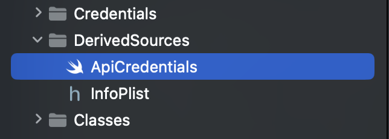

<h1 align="center"><br>for iOS</h1>

<p align="center">A Jetpack-powered companion app for WooCommerce.</p>

<p align="center">
    <a href="https://buildkite.com/automattic/woocommerce-ios">
        
    </a>
    <a href="https://github.com/woocommerce/woocommerce-ios/releases">
        
    </a>
    <a href="https://github.com/woocommerce/woocommerce-ios/blob/trunk/LICENSE">
        
    </a>
</p>

<p align="center">
    <a href="#-build-instructions">Build Instructions</a> •
    <a href="#-documentation">Documentation</a> •
    <a href="#-contributing">Contributing</a> •
    <a href="#-automation">Automation</a> •
    <a href="#-security">Security</a> •
    <a href="#-need-help">Need Help?</a> •
    <a href="#-resources">Resources</a> •
    <a href="#-license">License</a>
</p>

## 🎉 Build Instructions

1. Download Xcode

    At the moment *WooCommerce for iOS* uses Swift 5.7 and requires Xcode 14 or newer. Previous versions of Xcode can be [downloaded from Apple](https://developer.apple.com/downloads/index.action).

2. Install Ruby. We recommend using [rbenv](https://github.com/rbenv/rbenv) to install it. Please refer to the [`.ruby-version` file](.ruby-version) for the required Ruby version.

    We use Ruby to manage the third party dependencies and other tools and automation.

2. Clone project in the folder of your preference

    ```bash
    git clone https://github.com/woocommerce/woocommerce-ios.git
    ````

3. Enter the project directory

    ```bash
    cd woocommerce-ios
    ```

4. Install the third party dependencies and tools required to run the project.


    ```bash
    bundle install && bundle exec rake dependencies
    ```

    This command installs the required build tools and dependencies.

5. Open the project by double clicking on `WooCommerce.xcworkspace` file, or launching Xcode and choose File > Open and browse to `WooCommerce.xcworkspace`

### Credentials for External Contributors

In order to login to WordPress.com using the app:

1. Create a [WordPress.com account](https://wordpress.com/start/user) (if you don't already have one).
2. Create a new developer application [here](https://developer.wordpress.com/apps/).
3. Set **"Website URL"** = `http://www.wordpress.com`, **"Redirect URLs"** = `https://localhost`, **"Javascript Origins"** = `https://localhost` and **"Type"** = `Native` and click **Create**. On the next page, click **Update**.
4. Copy the *Client ID* and *Client Secret* from the OAuth Information.
5. Build the app. A file named `ApiCredentials.swift` should be generated.
6. Navigate to the generated `WooCommerce/DerivedSources/ApiCredentials.swift` file.

    

7. Fill in the `dotcomAppId` with the Client ID.
8. Fill in the `dotcomSecret` with the Client Secret.
9. Recompile and run the app on a device or inside simulator.

Please, remember to not add this information on your commits and PRs.

## 📚 Documentation

- Architecture
    - [Overview](docs/architecture-overview.md)
    - [Networking](docs/NETWORKING.md)
    - [Storage](docs/STORAGE.md)
    - [Yosemite](docs/YOSEMITE.md)
    - [Hardware](docs/HARDWARE.md)    
- Coding Guidelines
    - [Coding Style](docs/coding-style-guide.md)
    - [Naming Conventions](docs/naming-conventions.md)
        - [Protocols](docs/naming-conventions.md#protocols)
        - [String Constants in Nested Enums](docs/naming-conventions.md#string-constants-in-nested-enums)
        - [Test Methods](docs/naming-conventions.md#test-methods)
    - [Choosing Between Structures and Classes](docs/choosing-between-structs-and-classes.md)
    - [Creating Core Data Model Versions](docs/creating-core-data-model-versions.md)
    - [Localization](docs/localization.md)
    - [Switch Statements](docs/switch-statements.md)
- Design Patterns
    - [Copiable](docs/copiable.md)
        - [Generating Copiable Methods](docs/copiable.md#generating-copiable-methods)
        - [Modifying The Copiable Code Generation](docs/copiable.md#modifying-the-copiable-code-generation)
    - [Fakeable](docs/fakeable.md)
        - [Generating Fake Methods](docs/fakeable.md#generating-fake-methods)
        - [Modifying Fakes Code Generation](docs/fakeable.md#modifying-the-fakeable-code-generation)
    - [Tracking Events](docs/tracking-events.md)
        - [Custom Properties](docs/tracking-events.md#custom-properties)
- Quality & Testing
    - [UI Tests](WooCommerce/WooCommerceUITests/README.md)
    - [Testing Card Present Payments](docs/stripe-tests.md)
    - [Beta Testing](https://woocommercehalo.wordpress.com/setup/join-ios-beta/)
- Features
    - [In-app Feedback](docs/in-app-feedback.md)
    - [Card Present Payments](docs/card-present-payments.md)
- Other
    - [Enable hot reload with Inject](docs/inject-hot-reload.md)

## 👏 Contributing

Read our [Contributing Guide](CONTRIBUTING.md) to learn about reporting issues, contributing code, and more ways to contribute.

## 🤖 Automation

### Peril

The woocommerce-ios project uses [Peril](https://danger.systems/js/guides/peril.html) to enforce Pull Request guidelines.

### Circle CI

The woocommerce-ios project uses [Circle CI](https://circleci.com/gh/woocommerce/woocommerce-ios) for continuous integration.

## 🔐 Security

If you happen to find a security vulnerability, we would appreciate you letting us know at https://hackerone.com/automattic and allowing us to respond before disclosing the issue publicly.

## 🦮 Need Help?

You can find the WooCommerce usage docs here: [docs.woocommerce.com](https://docs.woocommerce.com/)

General usage and development questions:

* [WooCommerce Slack Community](https://woocommerce.com/community-slack/)
* [WordPress.org Forums](https://wordpress.org/support/plugin/woocommerce)
* The WooCommerce Help and Share Facebook group

## 🔗 Resources

- [Mobile blog](https://mobile.blog)
- [WooCommerce API Documentation (currently v3)](https://woocommerce.github.io/woocommerce-rest-api-docs/#introduction)

## 📜 License

WooCommerce for iOS is an Open Source project covered by the [GNU General Public License version 2](LICENSE).


<p align="center">
    <br/><br/>
    Made with 💜 by <a href="https://woocommerce.com/">WooCommerce</a>.<br/>
    <a href="https://woocommerce.com/careers/">We're hiring</a>! Come work with us!
</p>
