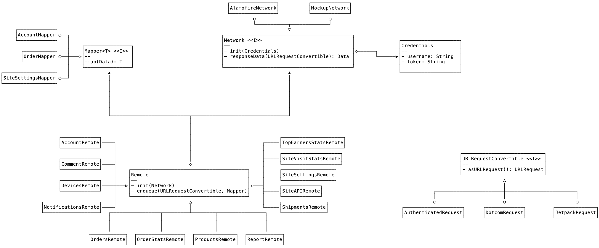

# Networking
> This module encapsulates the implementation of the network requests, including parsing of results and relevant model objects.  

## High level class diagram

## Remote
A `Remote` performs network requests. This is the core of this module.  

The base implementation of `Remote`  is provided an implementation of the `Network` protocol, and enqueues pairs of `Request` and `Mapper`, executing that request on the provided `Network` and delegating the parsing of the response to the `Mapper` provided. 

There is a subclass of `Remote` for each relevant concern. Each of these subclasses provide public methods for each of the networking operations relevant to that concern.

These are the current subclass of `Remote`:
* `AccountRemote`.  Provides methods to load an account, load sites, and load a site plan
* `CommentRemote`. Provides an api  to moderate a comment.
* `DevicesRemote`. Provides api to register and deregister a device
* `Notificationsremote`.  API to load notes, hashes, and update read status and last seen
* `OrdersRemote`. Load all orders, an individual order, notes associated to an order, update an order status, and search orders
* `OrderStatsRemote`. Loads stats associated to an order
* `ProductsRemote`Loads all Products and a single Product
* `ReportRemote`. Loads an order totals report and all known order statuses
* `ShipmentsRemote` All things Shipment Tracking, from tracking providers to actual tracking associated to an order
* `SiteAPIRemote` Loads the API information associated to a site.
* `SiteSettingsRemote` Loads a site’s settings
* `SiteVisitStatsremote` fetches visitor stats for a given site
* `TopEarnersStatsRemote`fetches the top earner stats for a given site.

## Network
A protocol that abstracts the networking stack. 

There are two implementations of this protocol: `AlamofireNetwork` which manages a networking stack based on the third party library Alamofire, and `MockupNetwork` which is a mock networking stack that does not actually hit the network, to be used in the unit tests.

## Mapper
A protocol that abstracts the different parsers.

There are several implementations of this protocol, roughly one per Remote, although in some cases there is more than one implementation per remote (roughly, one for a single model object, and another for a collection of the same model object). 

Mappers receive an instance of `Data` and return  the result of parsing that data as a model object or a collection of model objects.

## Model objects
Model objects declares in `Networking` are immutable, and modelled as value types (structs) that implement `Decodable`

Model objects should implement `Comparable` .
