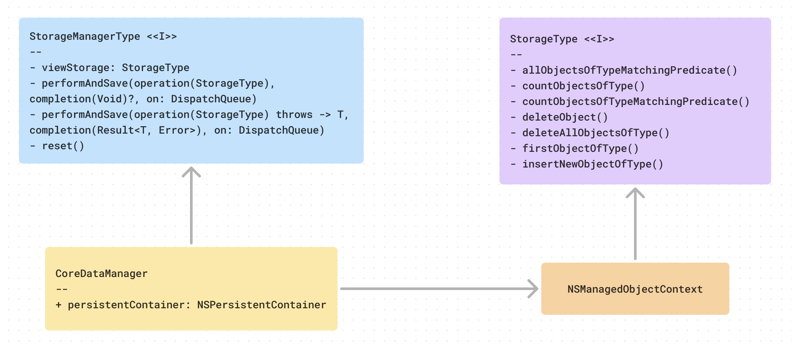

# Storage

> This module encapsulates the local persistence layer, and provides an implementation of that persistence layer based on CoreData.  

## High level class diagram

## Public interface
The Storage module exposes its functionality via the [`StorageManagerType`](../Storage/Storage/Protocols/StorageManagerType.swift) protocol. 

This protocol declares getters to [`StorageType`](../Storage/Storage/Protocols/StorageType.swift) and methods to save or perform an operation on a `StorageType` 

## The CoreData stack
The default implementation of the `StorageManagerType` and `StorageType` protocols is based on CoreData.

 `StorageManagerType` is implemented by the [`CoreDataManager`](../Storage/Storage/CoreData/CoreDataManager.swift) class. As the name implies, this class manages a CoreData stack, aggregating a `NSPersistentContainer`.

When clients of this class request a `StorageType`, `CoreDataManager` will return an `NSManagedObjectContext`. 

When `CoreDataManager` is requested a  `viewContext`, it will provide  the persistent container’s `viewContext` . When it is requested a `newDerivedStorage` it will return a new child context with  a private dispatch queue.

## File storage
The Storage module also exposes a protocol, called [`FileStorage`](../Storage/Storage/Protocols/FileStorage.swift) to abstract saving and reading data to and from local storage. 

The default implementation of this protocol, [`PListFileStorage`](../Storage/Storage/Tools/PListFileStorage.swift) provides support for `.plist` files.  

## Model objects
This module also provides extensions to make the model objects declared in the `Networking` module coredata-compliant.  

That is achieved by extending the model objects declared in `Networking` to make them extend `NSManagedObject` and provide `@NSManaged` properties and CoreData compliant accessors to some of those properties. Those extensions can be generated directly inside Xcode.
