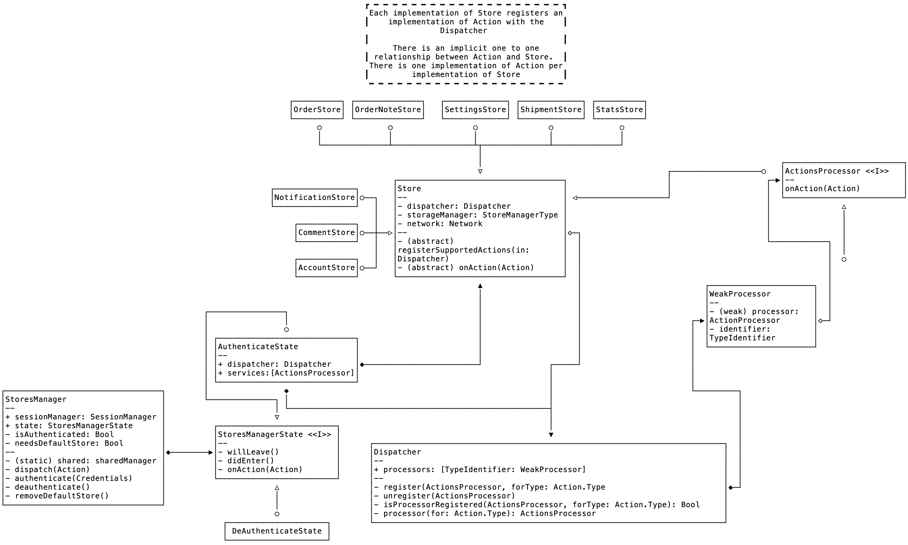
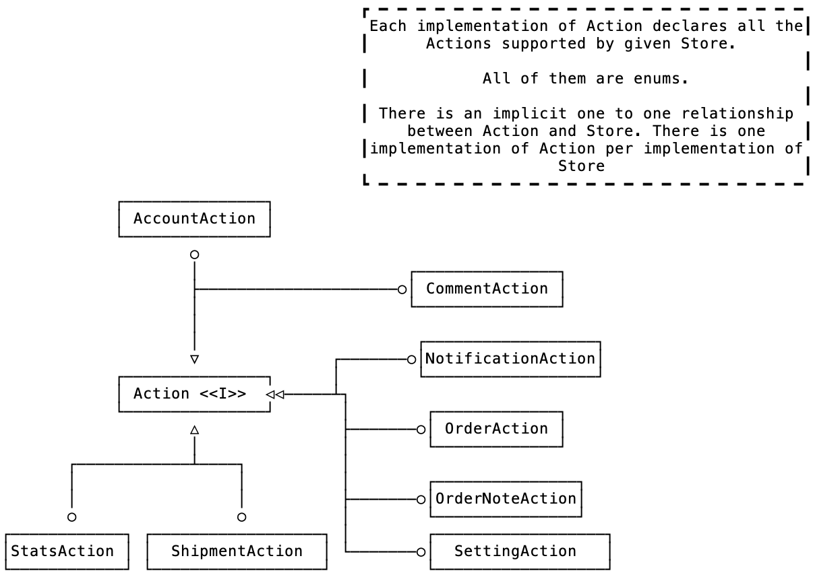

# Yosemite
> This module encapsulates the application business logic, and interacts with the Networking and Storage layers.   

## High-level class diagram


## Application state. StoresManagerState
Business logic is broken down into different subclasses of   [`Store`](https://github.com/woocommerce/woocommerce-ios/blob/develop/Yosemite/Yosemite/Base/Store.swift).   A `Store` encapsulates the business logic related to one and only one of the domain level concerns (i.e. Notifications, Orders, Shipment…).

Some of these concerns require a valid user session (a user to be logged into the system) while some others don’t require a session.  To handle that, `Store`s are aggregated by a [`StoresManager`](https://github.com/woocommerce/woocommerce-ios/blob/develop/WooCommerce/Classes/ServiceLocator/StoresManager.swift).

`StoresManager` is a state machine, that manages two states. Those states are implementations of the `StoresManagerState` protocol. Currently, we have two implementations, [`AuthenticatedState`](https://github.com/woocommerce/woocommerce-ios/blob/develop/WooCommerce/Classes/Yosemite/AuthenticatedState.swift) and [`DeauthenticatedState`](https://github.com/woocommerce/woocommerce-ios/blob/develop/WooCommerce/Classes/Yosemite/DeauthenticatedState.swift).

Each of the implementations of the `StoresManagerState` aggregates a collection of subclasses of `Store` protocol. That’s how we enforce certain concerns (i.e. Orders) to require users to be authenticated.

`StoresManager` takes care of the transition from the authenticated (`AuthenticatedState`) to the deauthenticated (`DeauthenticatedState`) state, while executing the necessary side effects of those transitions (for example, clearing the user data locally stored)

`StoresManager` is a singleton. 

ℹ️ The `AuthenticatedState` aggregates a reference to `Dispatcher`. **This is an important piece of the system, as it is responsible for executing the actions declared in the different Stores**. Therefore we will discuss it in depth later on.

## Domain level concerns. Store
As mentioned in the previous section, the business logic pertaining each domain level concern is encapsulated in a separate subclass of `Store`.

`Store` is an implementation of the `ActionsProcessor` protocol. We will discuss this protocol later, but for now, let’s say it is _something that can process an action_.

`Store` is injected with a reference to a [`Dispatcher`](https://github.com/woocommerce/woocommerce-ios/blob/develop/Yosemite/Yosemite/Base/Dispatcher.swift), an implementation of the  [`StorageManagerType`](https://github.com/woocommerce/woocommerce-ios/blob/develop/Storage/Storage/Protocols/StorageManagerType.swift)  protocol (the storage stack) and an implementation of the [`Network`](https://github.com/woocommerce/woocommerce-ios/blob/develop/Networking/Networking/Network/Network.swift) protocol (the networking stack).

As a quick aside, please note this pattern: dependencies are usually injected.

`Store` is a lightweight implementation of the [Template Method Pattern](https://en.wikipedia.org/wiki/Template_method_pattern). It enforces its subclasses to implement a method  (called `registerSupportedActions`) that will register a collection of _supported actions_ with the `Dispatcher` and to implement a method that deals with incoming actions.  We will discuss what actions are and how they are modelled a bit later.

Each subclass of `Store` registers a processor with the `Dispatcher`. To register a processor, a subclass of `Store` overrides `registerSupportedActions`. In the implementation of that method, it will register itself as processor, for a given set of actions.

That set of actions is declared in an implementation of the `Action` protocol. We will look at `Action` in details in the next section, but for now,  it is important to note that there is a one to one relationship between each subclass of `Store` and a corresponding implementation of the `Action` protocol. (i.e. for `AccountStore` we would also have a `AccountAction`).

At the moment, we provide the following subclasses of `Store`:
* `AccountStore`. Registers `AccountAction` with the `Dispatcher`.  It implements the business logic necessary to manage an account (load an account, load a site, synchronise account information…)
* `AppSettingsStore`. Registers and responds to actions declared in `AppSettingsAction`. It implements the logic to save and retrieve application settings.
* `CommentStore`.  Registers and responds to actions declared in `CommentAction` It implements the business logic pertaining comments.
* `NotificationStore`. Registers  and responds to`NotificationAction` 
* `OrderStore`. Registers `OrderAction` with the `Dispatcher` and responds to the actions declared in it.
* `OrderNoteStore`. Business logic pertaining order notes. Registers and responds to operation declared in `OrderNoteAction`
* `OrderStatusStore`. Business logic related to order payment statuses, implementing operations declared in `OrderStatusAction`
* `SettingStore` registers and responds to operations declared in `SettingAction`
* `StatsStore` responds to operations declared in `StatsAction`, providing support for the order stats.
* `StatsStoreV4` responds to operations declared in `StatsActionV4`, providing support for the order stats based on the V4 API, yet to be integrated in the UI.
* `ShipmentStore` implements support for the operations declared in `ShipmentAction`
* `TaxClassesStore` implements support for the operations declared in `TaxClassesAction`
* Finally, `StatStore`implements the logic to present statistics, supporting operations declared in `StatsAction`

## Operations with domain level concerns. Action
As mentioned in the precious section, there is an implementation of the `Action` protocol per domain level concern. 

The `Action` protocol is a tag interface. 

An implementation of `Action` declares the facade to the business logic that corresponds to the domain level concern it represents. 

To illustrate that with an example, let’s think of statistics. WooCommerce presents different types of statistics (related to an order, to the number of visitors to the store, of the top earning product, to name a few).

Each of those types of statistics will be declared by a different method in the implementation of `Action` called `StatsAction`.

All current implementations of the `Action` protocol are enumerations.

`Action`s work in close cooperation with `Store`s. An `Action` declares a number of operations that the `Store` will implement.



## Putting it all together. Executing an action to fetch data.
To continue with the example of the statistics, let’s say we want to present the statistics related to the top earning products.

The sequence for the UI layer to trigger a request to fetch data would be:
* Initialise the operation that we want to perform. In this case that would mean getting an `Action` (the return value of a `StatsAction.retrieveTopEarnerStats`,) passing it a completion block.
* Dispatch that operation to the `StoresManager`
* The `StoresManager` will find the currently active `StoresManagerState`, forward that operation to the `Dispatcher` aggregated by it, which in turn will forward it to whatever `Store` registered as capable of handling it (in our example, `StatsStore`)

The full listing:

```swift
func syncTopPerformers(onCompletion: ((Error?) -> Void)? = nil) {
    let action = StatsAction.retrieveTopEarnerStats(siteID: siteID,
                                                    granularity: granularity,
                                                    latestDateToInclude: Date()) { [weak self] error in
        // Error handling removed for brevity
        onCompletion?(error)
    }

    ServiceLocator.storesManager.dispatch(action)
}
```

## Rationale?
Why did we implement it that way?

We wanted the design to be highly cohesive and loosely coupled. We also wanted the design to be able to be capable of supporting adding new domain level concerns, without having to rewrite the pre-existing code.

### High cohesion
The system, is highly cohesive. Each module has a distinct, clearly defined responsibility. `StatsStore` implements business logic for statistics, and `NotificationsStore` for notifications. There are no mixed responsibilities.

### Low coupling
Individual modules don’t know anything about the implementation of other modules. Modules collaborate without knowing too much about each other.

## Building for the future.
When designing the system, we wanted to be able to add new domain level concerns (i.e. shipment tracking or custom order statuses) without having to rewrite any significant part of the system.

Adding new domain level concerns is a matter of adding  the `Action` declaring the facade of the operations that are required to fulfil that concern, and the `Store` that implements those operations (and related networking and storage, which will be reviewed in a separate document). The rest of the system remains unchanged.
